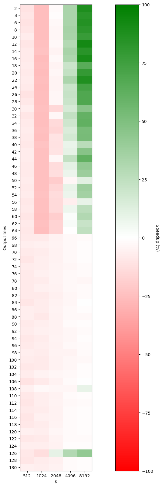
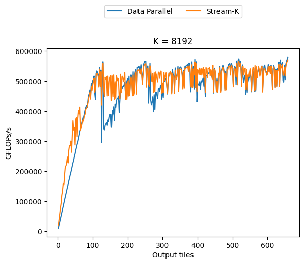

# Profiling and plotting utilities for stream-K performance optimization

This directory contains scripts that are useful in profiling and plotting stream-K performance.

## Setup
Plotting requires a Python environment with `matplotlib` installed.

On ComputeLab, you can create a Python 3.11 virtual environment via
```bash
/home/utils/Python-3.11.0/bin/python3 -m venv ~/scratch/venvs/py311
source ~/scratch/venvs/py311
```

You can enter into this virtual environment via
```bash
source ~/scratch/venvs/py311/bin/activate
```

At this point, all commands in your shell should be prefixed with `(py311)` (or whatever you named your virtual environment).

If you wish to exit this venv, you can do so via
```bash
deactivate
```

To install `matplotlib`, ensure that your virtual environment is activated (check for `(py311)` in your command line) and perform
```bash
pip install matplotlip
```

You can verify that this was successful by performing:
```bash
python -c "import matplotlib"
```

## Profiling script
We often wish to compare the performance of stream-K kernels against their data-parallel counterparts. The script [compare.sh](compare.sh) facilitates this by comparing the performance of stream-K and data-parallel tiles across a variety of K values and number of output tiles.

The script assumes that CUTLASS has been configured with two kernels in the profiler: one using stream-K and one that does not.

The script accepts the following command line arguments:
* `first_wave_idx`: the index of the first wave used in generating the number of output tiles to profile (e.g., `0` means start with the minimum number of output tiles, `1` means start from a number of output tiles equal to `num_sms`)
* `last_wave_idx`: the index of the final wave used in generating the number of output tiles to profile. The script will profile a number of output tiles in the range `[first_wave_idx, last_wave_idx]`
* `outfile`: path to a file to which CSV results will be written

Here's an example for SM90.

First, configure the CUTLASS library to have two kernels that differ only in their use of stream-K:
```bash
mkdir build && cd build
cmake .. -DCUTLASS_NVCC_ARCHS="90a" -DCUTLASS_LIBRARY_KERNELS="cutlass3x_sm90_tensorop_s64x128x16gemm_bf16_bf16_f32_bf16_bf16_128x128x64_2x1x1_0_nnn_align8_stream_k_warpspecialized_cooperative_epi_tma,cutlass3x_sm90_tensorop_gemm_bf16_bf16_f32_bf16_bf16_128x128x64_2x1x1_0_nnn_align8_warpspecialized_cooperative_epi_tma"
make cutlass_profiler -j8
```

Next, run the script:
```bash
../tools/scripts/scheduling/stream_k_perf/compare.sh 0 0 out.csv
```

You should see lines printed to `stdout` comparing the performance of stream-K and non-stream-K kernels for varying K values and number of output tiles:
```
K,M,N,Tiles,Baseline-GFLOPs/s,New-GFLOPs/s,Speedup
512,128,256,2,3631.48,3244.07,-10.67
512,256,256,4,7403.19,6654.15,-10.12
512,256,384,6,10864.8,9760.84,-10.16
...
```

You can use the result in `out.csv` for plotting.

## Heatmap comparing K and output tiles
The benefit of stream-K over data-parallel kernels typically depends on the value of K and amout of wave quantization in the kernel: typically, the higher K and the more wave quantization, the larger potential benefit from stream-K.

It is useful to have heuristics for determining when to use stream-K or to use a data-parallel GEMM. The following plot helps inform this by plotting a heatmap of the speedup of the profiled stream-K kernel over the profiled data-parallel kernel as K and output tiles vary.

```bash
python plot_heatmap.py out.csv heatmap.png
```

Here's an example of this output:


The X axis of the plot shows the values of K profiled and the Y axis shows the number of output tiles profiled. The color of each box determines the speedup of the stream-K kernel over the data-parallel kernel: green indicates a speedup for stream-K and red indicates a slowdown.

As expected, this plot shows that, for a single wave, stream-K gives the largest benefit with high values of K and a small number of output tiles.

## Line plot comparing stream-K and data-parallel modes
Another useful plot is to compare the performance of stream-K and data-parallel kernels with a fixed value of K as the number of output tiles varies.

This can be done via:
```bash
python plot_line.py out.csv outdir
```

This will plot one image per value of K found in `out.csv`, each within `outdir`.

Here's an example for K of 8192:



The X axis shows the number of output tiles profiled and the Y axis shows the GFLOPs/s achieved.

We see distinct trends. Focusing on the data-parallel (blue) line, we see that performance typically oscillates in accordance with wave boundaries. After a wave boundary is hit, the data-parallel kernel achieves significantly lower performance due to needing to run an additional wave. In contrast, the stream-K kernel smooths this out: it maintains higher performance when wave quantization occurs.

## Additional utilities

Sometimes one wants to perform these comparisons of a stream-K kernel with some tweak compared to the original version of the stream-K kernel without the tweak. One can perform these comparisons by parsing to individual profiling result files and combining the stream-K results.

This can be done via:
```bash
python combine.py out-original.csv out-new.csv
```

This will create a new version of the output files but with `New-GFLOPs/s` from `out-original.csv` becoming `Baseline-GFLOPs/s` of the output, and with the speedup being generated based on a comparison of the `New-GFLOPs/s` across the two files.

